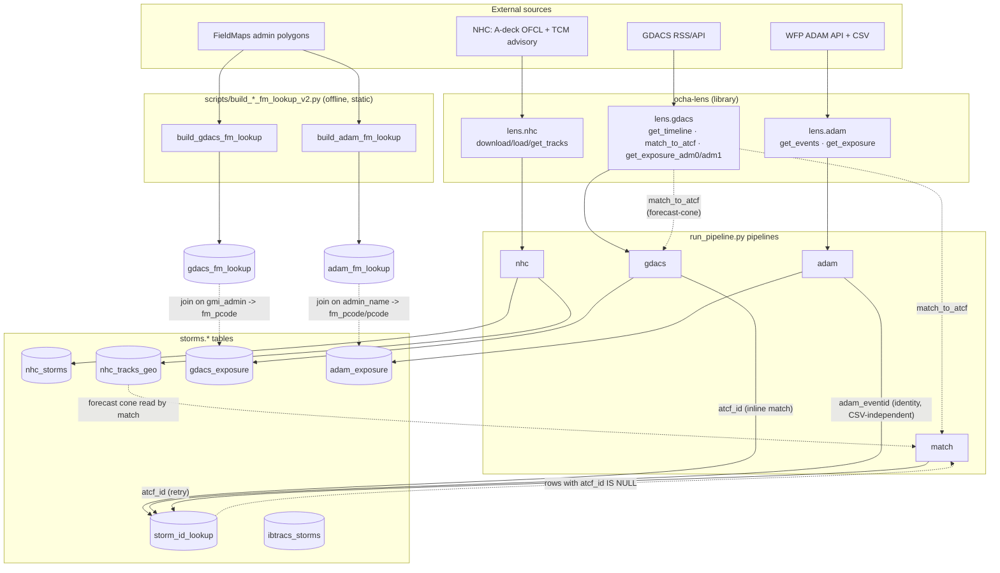
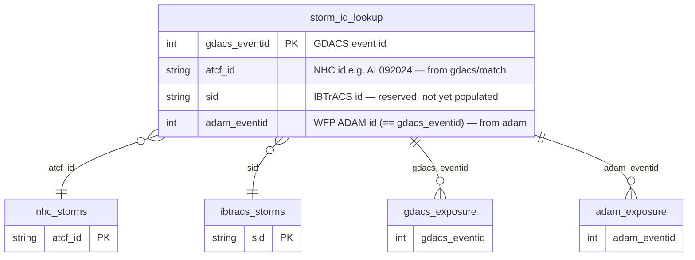

# GDACS / ADAM data model & pipeline wiring

How the `ocha-lens` data clients, the `run_pipeline.py` pipelines, and the
`storms.*` tables fit together — and how a single storm is linked across
sources.

## Two layers

- **`ocha-lens`** (`ocha_lens.datasources.*`) is the library layer: HTTP/parse
  clients that turn NHC / GDACS / ADAM sources into DataFrames. It owns no
  tables.
- **`ds-storms-pipeline`** (`run_pipeline.py <cmd>`) is the orchestration layer:
  it calls the clients and writes/reads the `storms.*` Postgres tables.

## Dataflow

## The linking hub: `storm_id_lookup`

One storm, one row, keyed on `gdacs_eventid` (PK in the current shape). The
other columns are the same storm's id in each source:

How each column gets filled:

| column | written by | how |
|---|---|---|
| `gdacs_eventid` | `gdacs`, `adam` | PK; every row originates from a GDACS/ADAM event ingest |
| `atcf_id` | `gdacs` (inline), `match` (retry) | `lens.gdacs.match_to_atcf` — forecast-cone match of the GDACS timeline against `nhc_tracks_geo`, genesis fallback for dissipated storms |
| `adam_eventid` | `adam` | identity link `adam_eventid = event_id`, recorded for every event `get_events` returns (independent of whether the exposure CSV downloads) |
| `sid` | — | reserved for a future IBTrACS-side enrichment step |

## FieldMaps crosswalks (`*_fm_lookup`)

`gdacs_fm_lookup` and `adam_fm_lookup` are **static reference tables**, not
produced by the runtime pipelines. They are rebuilt offline by
`scripts/build_gdacs_fm_lookup_v2.py` / `build_adam_fm_lookup_v2.py`, which run
the IoU spatial matchers in `src/static/{gdacs,adam}/matcher.py` to pair each
GDACS/ADAM admin unit with its canonical FieldMaps p-code.

- `gdacs_fm_lookup`: join `gdacs_exposure.gmi_admin → gdacs_fm_lookup.gmi_admin`
  to attach `fm_pcode` / `fm_name`.
- `adam_fm_lookup`: join `adam_exposure.admin_name → adam_fm_lookup.adam_admin_name`
  to attach `fm_pcode` (→ `adam_exposure.pcode`). Built per-ADAM-admin so each
  ADAM unit maps to exactly one FM p-code (no name fan-out).

`caveat_kind` flags non-clean matches (admin-level mismatches, aggregation,
manual-mapping needs); `NULL` = clean 1:1.

## Schema files

DDL lives in `src/schemas/sql/`. Tables relevant to the linking system:
`storm_id_lookup.sql`, `gdacs_exposure.sql`, `adam_exposure.sql`,
`nhc_tables.sql` (`nhc_storms`, `nhc_tracks_geo`), `gdacs_fm_lookup.sql`,
`adam_fm_lookup.sql`.

> Note: several other `storms.*` tables exist in the DB without schema files yet
> (e.g. `admin_population`, the `nhc_wsp_*` and `nhc_tracks_*_buffers/exposure`
> wind/exposure tables, `ibtracs_wind_*`). Those belong to other subsystems and
> are out of scope here.
