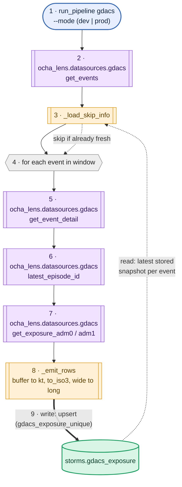
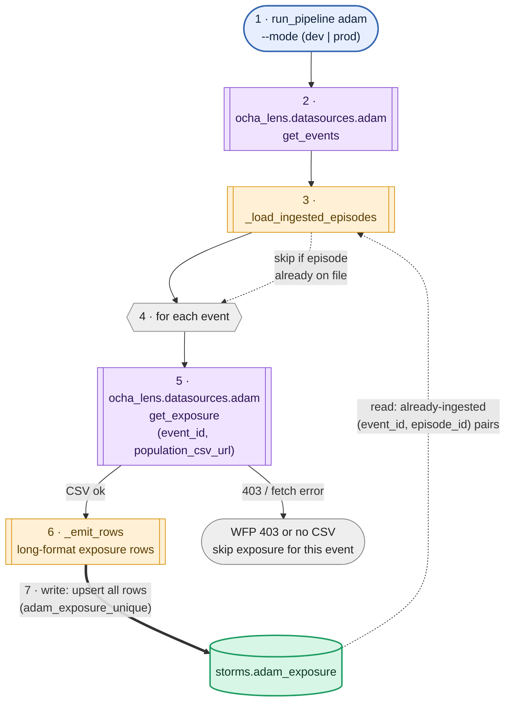
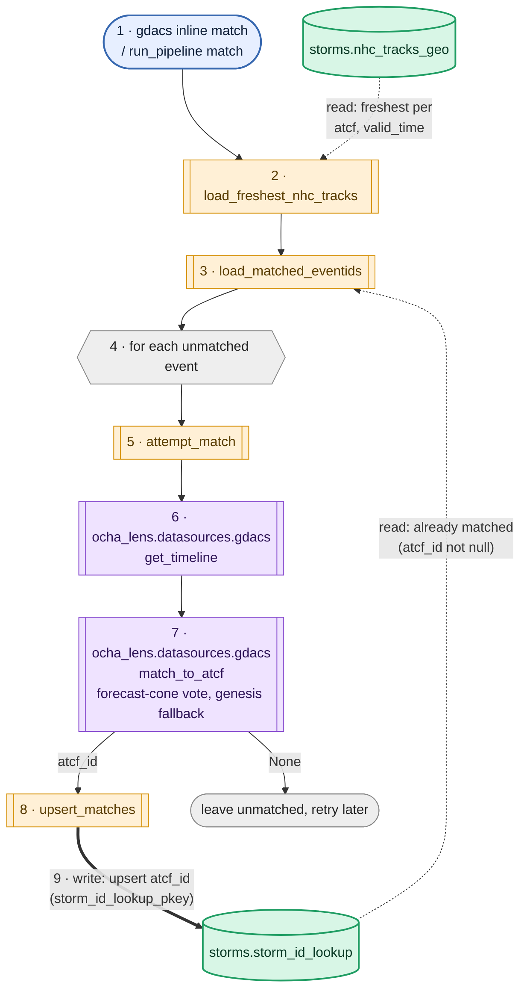
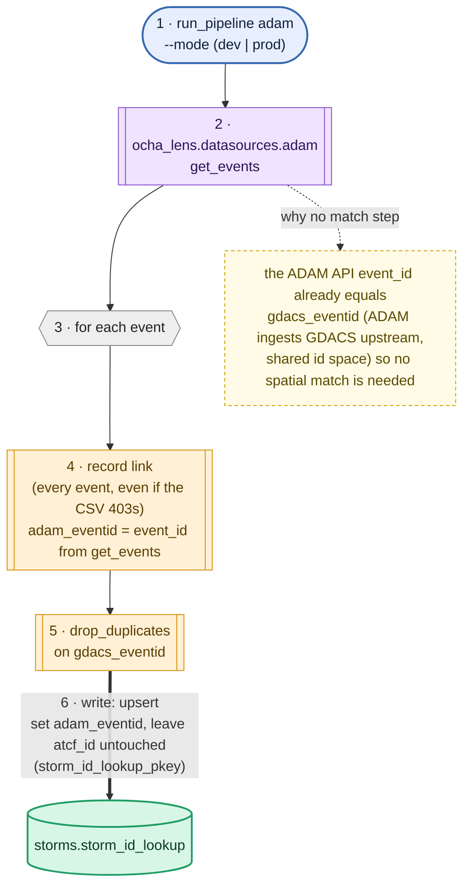

# GDACS / ADAM data model & pipeline wiring

How the GDACS and ADAM pipelines (`run_pipeline.py gdacs` / `adam`) fill the
`storms.*` tables, and how a single storm gets linked across sources. Each
pipeline does two distinct jobs, so each gets two diagrams:

1. **ETL** — fetch exposure and fill the exposure table.
2. **Storm ID lookup** — record the storm's cross-source ids in
   `storms.storm_id_lookup`.

**Reading the diagrams**

| symbol | meaning |
|---|---|
| `[[ ... ]]` subroutine, purple | `ocha_lens.datasources.*` library call |
| `[[ ... ]]` subroutine, amber | pipeline / `match.py` helper function |
| `[( ... )]` cylinder, green | Postgres table (`storms.*`) |
| stadium | CLI entry point |
| hexagon | per-event loop |
| dotted edge | **read** from a table |
| thick edge | **write** (upsert) to a table |

Steps are numbered in execution order. The same exposure/lookup table is often
**read early** (skip cache) and **written late** (upsert) — watch the step
numbers on its two edges.

---

## 1. GDACS & ADAM ETL

How the exposure tables get filled. Same skeleton on both sides — fetch events,
load a skip cache, loop, fetch per-event exposure, upsert — but ADAM fetches a
single population CSV per event (which WFP often 403s) where GDACS fetches the
adm0/adm1 exposure off the event detail.

### GDACS → `storms.gdacs_exposure`

### ADAM → `storms.adam_exposure`

---

## 2. Storm ID lookup

How `storms.storm_id_lookup` gets each storm's cross-source ids. The two sides
are fundamentally different: GDACS resolves its NHC `atcf_id` by **spatial
matching** (the forecast cone against `nhc_tracks_geo`), while ADAM's link is a
pure **identity** — the ADAM API's `event_id` already equals `gdacs_eventid`
(shared id space), so no matching is needed.

### GDACS → `atcf_id` (spatial match)

### ADAM → `adam_eventid` (identity)

---

The standalone diagram sources live alongside this doc as
`gdacs-1-exposure-fill.mmd`, `adam-1-exposure-fill.mmd`,
`gdacs-2-atcf-match.mmd`, `adam-2-eventid-link.mmd`. Table DDL is in
`src/schemas/sql/` (`gdacs_exposure.sql`, `adam_exposure.sql`,
`storm_id_lookup.sql`, `nhc_tables.sql`).
